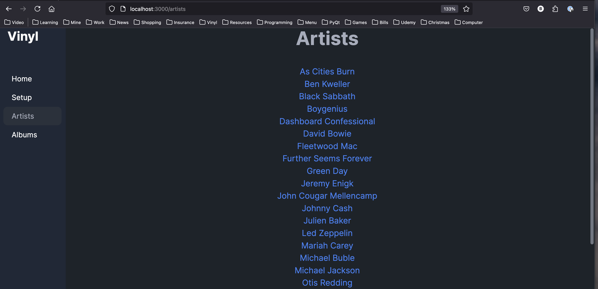
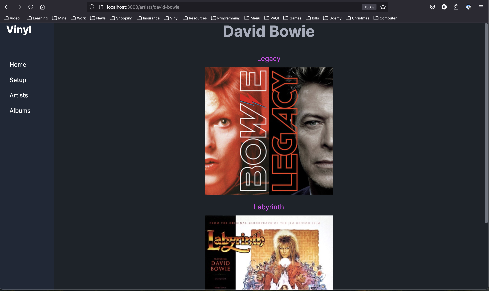
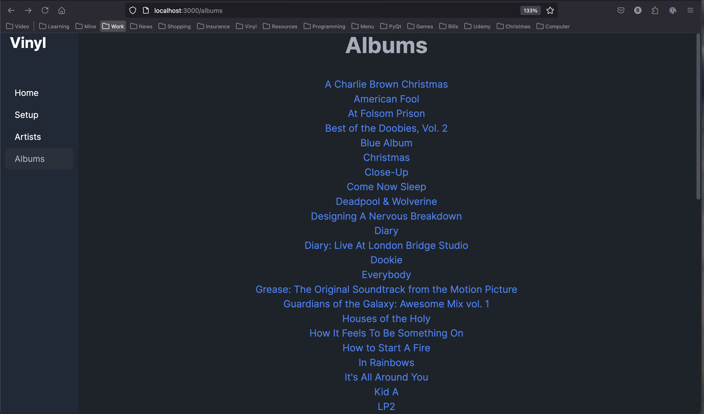

# Vinyl App 🎵  
A web application for managing and exploring my personal vinyl records.  

## 🚀 Getting Started  

### **Prerequisites**  
Ensure you have the following installed on your system:  
- [Ruby](https://www.ruby-lang.org/) (Version 3.0.0 recommended)  
- [Rails](https://rubyonrails.org/) (If not included in Gemfile)  
- [Bundler](https://bundler.io/) (`gem install bundler`)  
- SQLite3  
- Git  

### **📥 Cloning the Repository**  
To clone the repository, run:  
```sh
git clone https://github.com/brysonshelton/vinyl.git
cd vinyl
```
Run the following commands to install the required gems:
```sh
bundle install
```
Set up the database
```sh
rails db:create
rails db:migrate
rails db:seed
```
Start the rails server with
```sh
bin/dev
```
Then open: [http://localhost:3000](http://localhost:3000) in your browser
***
## 📸 Screenshots  

### Artists Page  


### David Bowie Albums  


### Albums Page
